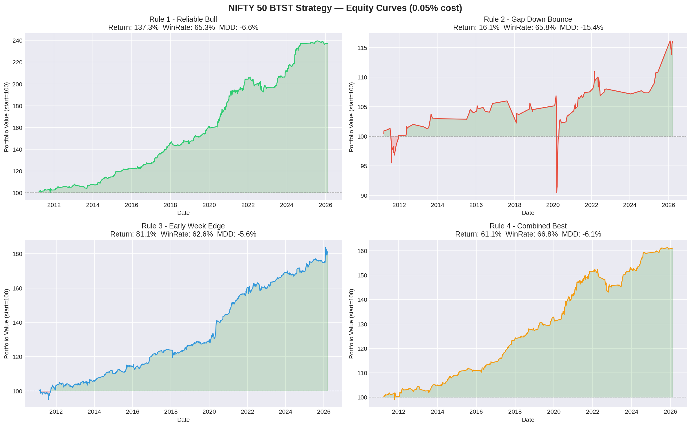
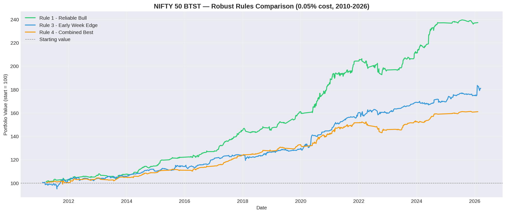

# NIFTY 50 BTST Research & Backtesting Framework

A systematic quantitative research project to discover and backtest
short-term (Buy Today, Sell Tomorrow) patterns in the NIFTY 50 index.

## Project Goals
- Research daily patterns: weekday effects, gap effects, trend regimes
- Convert strongest patterns into realistic tradable BTST rules
- Backtest with real Indian trading costs
- Extend framework to individual NIFTY 50 stocks

## Tools Used
- Python, Google Colab
- yfinance, pandas, numpy, matplotlib, seaborn

## Structure
| Folder | Contents |
|--------|----------|
| `notebooks/` | Research and backtest notebooks |
| `data/` | Processed datasets |
| `results/` | Backtest output tables |
| `charts/` | Visualizations |
| `reports/` | Final summary reports |

## Key Results

| Rule | Total Return | Win Rate | Max Drawdown |
|------|-------------|----------|--------------|
| Rule 1 - Reliable Bull | 137% | 65.3% | -6.6% |
| Rule 3 - Early Week Edge | 81% | 62.6% | -5.6% |
| Rule 4 - Combined Best | 61% | 66.8% | -6.1% |

> Tested on 15 years of NIFTY 50 data (2010-2026)  
> Cost assumption: 0.05% round trip (ETF/Futures)  
> All top rules passed 3-period robustness test  

## Charts

