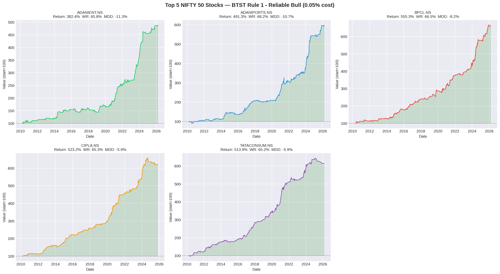
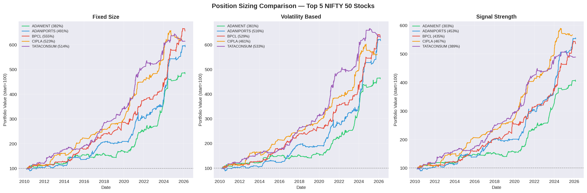
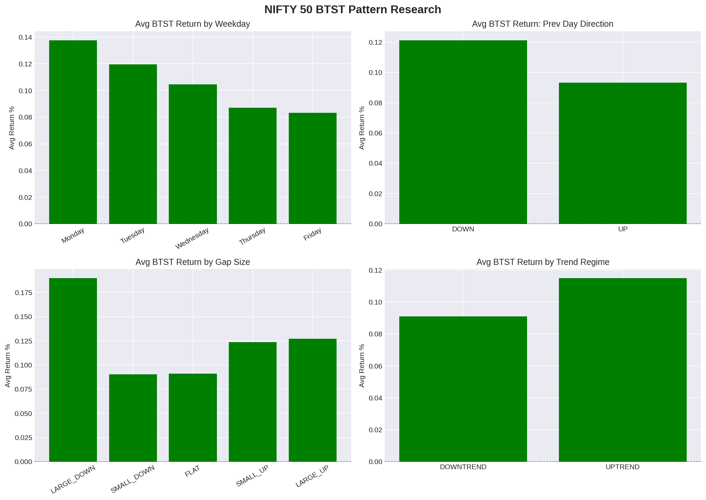

# NIFTY 50 BTST Research & Backtesting Framework

A complete systematic quantitative research project discovering 
and backtesting short-term BTST (Buy Today Sell Tomorrow) patterns 
in the NIFTY 50 index and individual stocks.

## Project Highlights

- 15 years of data analysed (2010 to 2026)
- 49 NIFTY 50 stocks tested
- 3 robust trading rules discovered and validated
- 3 position sizing methods compared
- All rules passed subperiod robustness testing

## Best Results Found

### NIFTY 50 Index (Rule 1 — Reliable Bull)
| Metric | Value |
|--------|-------|
| Total Return | 137% |
| Win Rate | 65.3% |
| Max Drawdown | -6.6% |
| Period | 2010 to 2026 |

### Top 5 Stocks (Rule 1 — Fixed Size, 0.05% cost)
| Stock | Total Return | Win Rate | Max Drawdown |
|-------|-------------|----------|--------------|
| BPCL | 555% | 66.5% | -8.2% |
| CIPLA | 523% | 65.3% | -5.9% |
| TATACONSUM | 514% | 65.2% | -5.9% |
| ADANIPORTS | 491% | 68.2% | -10.7% |
| ADANIENT | 382% | 65.8% | -11.3% |

## Trading Rules Discovered

**Rule 1 — Reliable Bull**
Buy when: small gap up + market in uptrend (above 50-day MA)

**Rule 3 — Early Week Edge**
Buy when: Monday or Tuesday + previous day was down

**Rule 4 — Combined Best**
Buy when: small gap up + uptrend + Monday/Tuesday/Wednesday

## Position Sizing Verdict
- Fixed Size wins or ties in 3 out of 5 stocks
- Volatility sizing marginally better for ADANIPORTS and TATACONSUM
- Signal Strength sizing gives best Profit Factor across all stocks

## Charts

## Tools Used
- Python, Google Colab
- yfinance, pandas, numpy, matplotlib

## Project Structure
| Folder | Contents |
|--------|----------|
| `notebooks/` | Research and backtest notebooks |
| `data/` | All result CSV files |
| `charts/` | All visualizations |

## Important Notes
- Results assume 0.05% round trip cost (ETF or Futures)
- At 0.20% cost edge disappears for index, reduces for stocks
- Research only — not financial advice
- Past performance does not guarantee future results

## Status
✅ Complete — Options A and B finished
🔄 Next: New strategy research (Option C)
